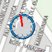
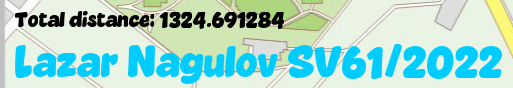

<a id="readme-top"></a>

[![Last Commit][last-commit-shield]][last-commit-url]


<div align="center"> 
    <h1 align="center">2D Map</h1> 
    <p align="center"> <br /> 
        <a href="https://github.com/lazarnagulov/2d-map/issues/new?labels=bug">Report Bug</a> 
    </p> 
</div> 

<details>
  <summary>Table of Contents</summary>
  <ol>
    <li>
      <a href="#about-the-project">About The Project</a>
      <ul>
        <li><a href="#built-with">Built With</a></li>
      </ul>
    </li>
    <li><a href="#screenshots">Screenshots</a></li> 
    <li><a href="#installation">Installation</a></li>
    <li><a href="#controls">Controls</a></li>
    <li>
      <a href="#project-structure">Project Structure</a>
      <ul>
        <li><a href="#key-design-patterns">Key Design Patterns</a></li>
      </ul>
    </li>
    <li>
      <a href="#configuration">Configuration</a>
      <ul>
        <li><a href="#adjusting-settings">Adjusting Settings</a></li>
        <li><a href="#custom-map">Custom Map</a></li>
      </ul>
    </li>
    <li>
      <a href="#development">Development</a>
      <ul>
        <li><a href="#adding-new-layers">Adding New Layers</a></li>
        <li><a href="#extending-the-renderer">Extending the Renderer</a></li>
      </ul>
    </li>
    <li><a href="#acknowledgments">Acknowledgments</a></li>
  </ol>
</details>

## About The Project


This project is a 2D C++/OpenGL application designed for navigation and distance measurement on a digital map. The rendering pipeline is built using modern OpenGL (3.0+ with programmable shaders).

The main objective of the program is to allow the user to move across a large high-resolution map and measure real-time traversed distance. The application features two interactive modes:

1. *Walking Mode* - the user moves across the map by controlling direction with WASD, while a navigation pin remains fixed at the center of the screen and the map scrolls beneath it. Movement distance is continuously tracked and displayed on screen.
1. *Measurement Mode* - the full map becomes visible, and the user can place multiple points with mouse clicks. Consecutive points form line segments, whose lengths accumulate into a total measured distance. Points can be removed dynamically, updating the total length in real time.

Mode switching is done via keyboard (R) or UI icons (a walker symbol and a ruler symbol depending on active state).
The application keeps state between modes - meaning the current position, traversal distance or placed measurement points remain preserved on swap.

<p align="right">(<a href="#readme-top">back to top</a>)</p>

## Built with

This project is implemented entirely in C++ and uses a modern OpenGL programmable pipeline along with several supporting libraries for rendering, input, and texture handling.

* [![C++][C++]][C++-url]
* [![OpenGL][OpenGL]][OpenGL-url]
* [![GLFW][GLFW]][GLFW-url]
* [![GLEW][GLEW]][GLEW-url]
* [![FreeType][FreeType]][FreeType-url]
* [![GLM][GLM]][GLM-url]

<p align="right">(<a href="#readme-top">back to top</a>)</p>

## Screenshots

| Preview | Description |
|--------|-------------|
|  | Walking mode with map scrolling under a centered pin |
|  | Full-map measurement mode with connected distance points |
|  | Custom compass cursor with red needle facing top-left |
|  | Semi-transparent label containing student name and index |

<p align="right">(<a href="#readme-top">back to top</a>)</p>

## Installation

Follow the steps below to build and run the project locally.

#### 1. Clone the repository

If the project includes third-party components inside the repo (fonts, shader sources, textures, etc.),
make sure to clone **recursively**:

```bash
git clone --recursive https://github.com/lazarnagulov/2d-map.git
cd 2d-map
```

If you forgot --recursive:
```bash
git submodule update --init --recursive
```

#### 2. Configure with CMake

Create a build folder and generate project files:
```bash
mkdir build
cd build
cmake ..
```

#### 3. Build & Run

You may now build the project in two ways:
- Open in Visual Studio / run .sln
- Build with CMake directly
```bash
cmake --build . --config Release
./2d-map  
```
<p align="right">(<a href="#readme-top">back to top</a>)</p>

## Controls

| Action | Input |
|-------|-------|
| Move across map (Walking Mode) | **W / A / S / D** |
| Place a point (Measurement Mode) | **Left Mouse Click** |
| Remove a point (when hovering on it)** | **Left Mouse Click** |
| Switch mode (Walk ↔ Measure) | **R** or click mode icon |
| Reset current mode state (distance or path)** | **0** |
| Zoom in (Walking Mode) | **+** |
| Zoom out (Walking Mode) | **-** |
| Exit application | **ESC** |

Cursor is visually represented as a **compass**, with the red needle pointing toward the **upper-left corner**.

<p align="right">(<a href="#readme-top">back to top</a>)</p>


## Project Structure

The project follows a layered architecture with clear separation of concerns:
```
2d-map/
├── src/
│   ├── core/              # Engine-level components
│   │   ├── rendering/     # Renderer, shaders, textures, buffers
│   │   ├── window/        # Window management, camera
│   │   ├── input/         # Input handling
│   │   ├── layers/        # Layer system (base classes)
│   │   └── utils/         # Frame limiter, utilities
│   ├── app/               # Application-specific code
│   │   ├── systems/       # EventDispatcher, LayerManager
│   │   ├── layers/        # WalkLayer, MeasureLayer, ModeLayer, CompassCursorLayer
│   │   └── states/        # AppState, WalkState
│   └── assets/
│       ├── shaders/       # GLSL vertex/fragment shaders
│       ├── textures/      # Map image, icons, cursor
│       └── fonts/         # TrueType fonts for text rendering
```

### Key Design Patterns

- **Layer System**: Modular UI/logic components that can be enabled/disabled
- **Event Dispatching**: Centralized input routing to active layers
- **State Management**: Separate state objects for persistent data

<p align="right">(<a href="#readme-top">back to top</a>)</p>

## Configuration

### Adjusting Settings

You can modify various parameters in `Application.cpp`:
```cpp
// Frame rate
app.Run(60.0f);  // Target 60 FPS

// Camera zoom limits (in WalkLayer.h)
m_MinZoom = 0.5f;
m_MaxZoom = 3.0f;

// Movement speed (in WalkState.h)
m_MoveSpeed = 200.0f;  // pixels per second
```

### Custom Map

To use your own map image:
1. Replace `./src/assets/textures/map.jpg` with your image
2. Recommended resolution: 2048x2048 or higher for best quality
3. Supported formats: JPG, PNG (via stb_image)

<p align="right">(<a href="#readme-top">back to top</a>)</p>

## Development

### Adding New Layers

To create a custom layer:
```cpp
// 1. Create your layer class
class MyLayer : public Layer {
public:
    void OnUpdate(float dt) override { /* ... */ }
    void OnRender(Renderer2D& renderer) override { /* ... */ }
    void OnKey(int key, int action) override { /* ... */ }
};

// 2. Add to Application constructor
m_MyLayer(m_LayerManager.AddLayer<MyLayer>(/* args */))
```

### Extending the Renderer

The `Renderer2D` supports:
- `DrawQuad()` — Textured or colored quads
- `DrawText()` — Dynamic text rendering
- `BeginScene()` / `EndScene()` — Render pass management

<p align="right">(<a href="#readme-top">back to top</a>)</p>

## Acknowledgments

* Font: Vaseline Extra
* Built as part of Computer Graphics course

<p align="right">(<a href="#readme-top">back to top</a>)</p>

[last-commit-shield]: https://img.shields.io/github/last-commit/lazarnagulov/2d-map?branch=main&style=for-the-badge
[last-commit-url]: https://github.com/lazarnagulov/2d-map/commits/main
[C++]: https://img.shields.io/badge/C%2B%2B-00599C?style=for-the-badge&logo=cplusplus&logoColor=white  
[C++-url]: https://isocpp.org/  
[OpenGL]: https://img.shields.io/badge/OpenGL-5586A4?style=for-the-badge&logo=opengl&logoColor=white  
[OpenGL-url]: https://www.opengl.org/  
[GLFW]: https://img.shields.io/badge/GLFW-232F3E?style=for-the-badge&logo=c&logoColor=white  
[GLFW-url]: https://www.glfw.org/  
[GLEW]: https://img.shields.io/badge/GLEW-000000?style=for-the-badge&logo=opengl&logoColor=white  
[GLEW-url]: http://glew.sourceforge.net/  
[FreeType]: https://img.shields.io/badge/FreeType-1B1F23?style=for-the-badge&logo=font-awesome&logoColor=white  
[FreeType-url]: https://freetype.org/  
[GLM]: https://img.shields.io/badge/GLM-3A3A3A?style=for-the-badge&logo=glm&logoColor=white  
[GLM-url]: https://github.com/g-truc/glm  